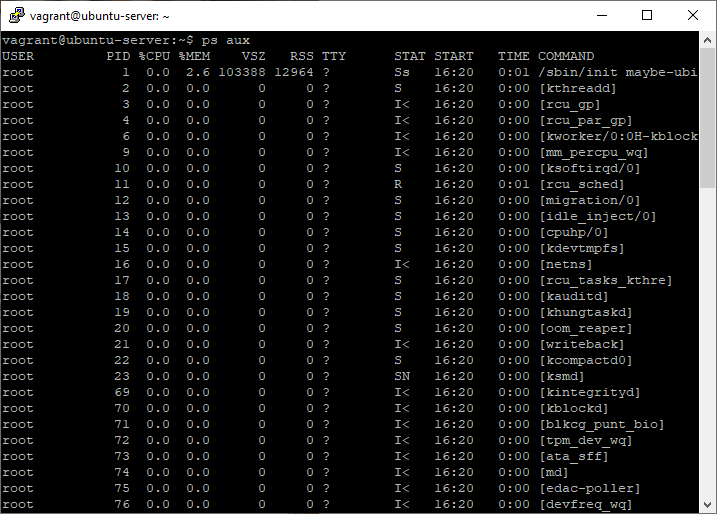
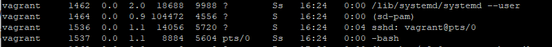

# Task 5.3
## Part 1
1. Process in Linux can have 4 state:
    - Running - the process is either already running or ready to run and is waiting for CPU time to be given to it
    - Stoped - in this state of awaiting some event or release of a system resource.
    - Terminated - usually, processes that were stopped by a signal are in this state
    - Zombie - dead processes, they were stopped and are no longer running, but there is an entry in the process table for them, possibly due to the fact that there are child processes left
2. The `pstree` command. 


3. The /proc file system

> `/proc` - process information pseudo-filesystem


4. Information about processor


5. The `ps` command information



6. Kernel and user process

> Kernel process have a PID from 1-999 and in ps information they display in `[]`


> User process have a user and display like a commmon command



7. List of process


Status| Description
------|------------
R|running
D|waiting for writing
S|dont active
T|terminated
Z|zombie


8. Specific user process


9. Analyze tasks


> You can use ps with grep to filter and serching information

10. Top information display


> Top dispay information about system workload  and information about processes

11. Top command user processes


12. Control top command


> `top` allows to change priority of the process and kill the process.
> Also you can customize info using sort and filters

13. Sort content of the process by using %MEM


14. `nice` and `renice` commands


15. top change priority


16. `kill` command 


> use `k` and set 6 or 9 signal 

Signal | Description
-------|-------------
1| Completion  
2| Interrupt
3| Quit
9| Kill
10| Bus error
11| Segmentation fault
15| Quit request
17| Stop
18| Stop signal sent from keyboard
19|Continue after stopping
28| Window change
30| User defined
31| User defined

17. `jobs` ,`fg` , `bg` and `nohup` commands


## Part 2

1. Use OpenSSH int the Windows 10

> to connect to the server use `ssh user@ip-adress -p 2222`


> If you use pubkeyauthorization use ssh-agent service for seting private key


> Add private key in ssh-agent base


 
> Aslo can execute command and terminate session


2. Set SSH on server

> configure sshd_config file for seting public key authorization and set 2222 port
and off PasswordAuthorization


> generate rsa keys 


> copy rsa keys on a host 


> write rsa key in authorized_keys file


> connetcion by using putty


> connection by using openssh windows client


3. Keys for encryption SSH

> generate keys 

```
ssh-keygen -t rsa -b 2048
ssh-keygen -t edcsa -b 512
ssh-keygen -t ed25519 -b 512
```


> copy keys on host


> rsa


> ecdsa-sha2-nistp512


> ed25519


4. port-forwading

> set port forwarding in VB


> connect to the server


5. Traffic intercept 

> run tcpdump to intercept traffic and write in file


> run ssh session


> run telnet session


> open data file in wireshark


> explore telnet traffic 


> explore ssh traffic


> So we can say that dont recomend use telnet for remote connection 