# Task 6.1 
 1. Create network

 > create VM1 with NAT and internal interfaces
 > create VM2 with internal interface

 2. Configure VM1

    > set ip adress for VM1 using netplan

    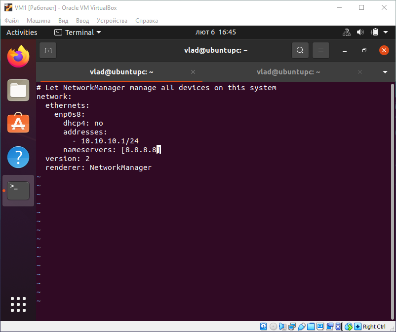

    > enable NAT and configure  traffic forwading from VM2
 
    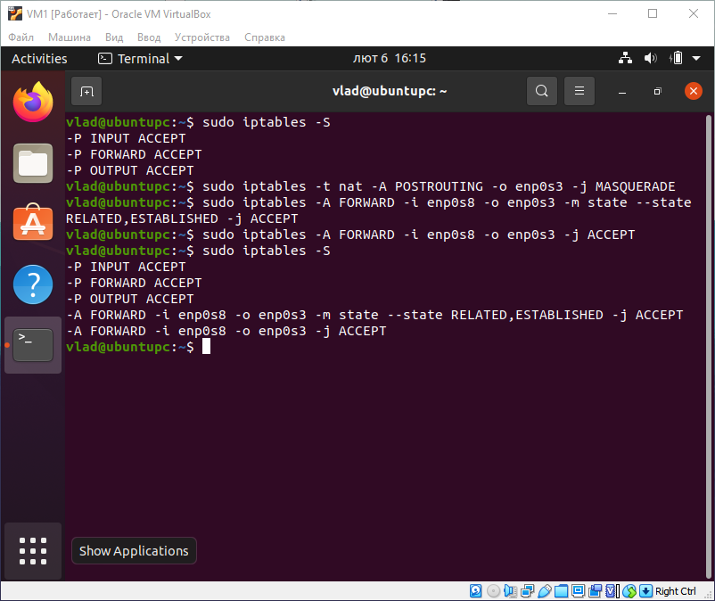

    > Enable packet forwading

    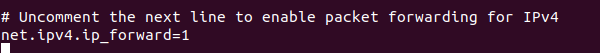

    > Check configuration

    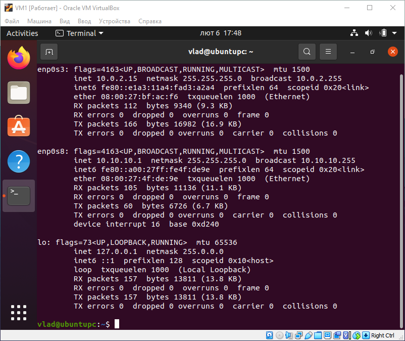

 3. Configure VM2

    > set ip adress for VM2 using netplan

    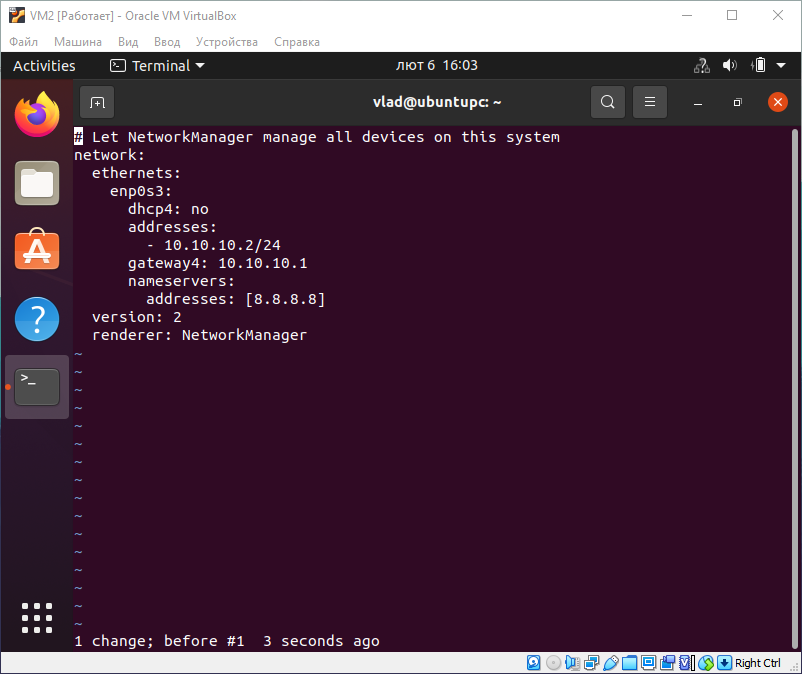

    > check configuration

    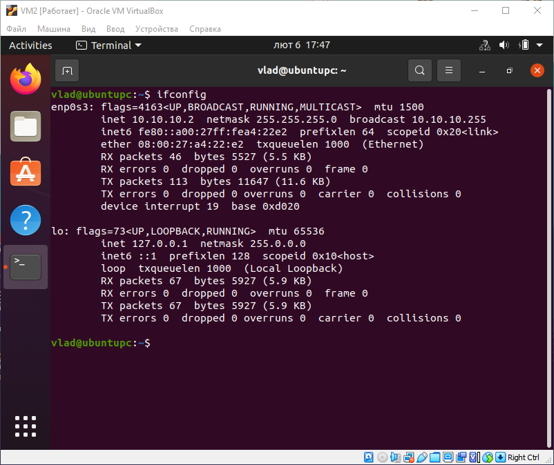

 4. Check the route from VM to host

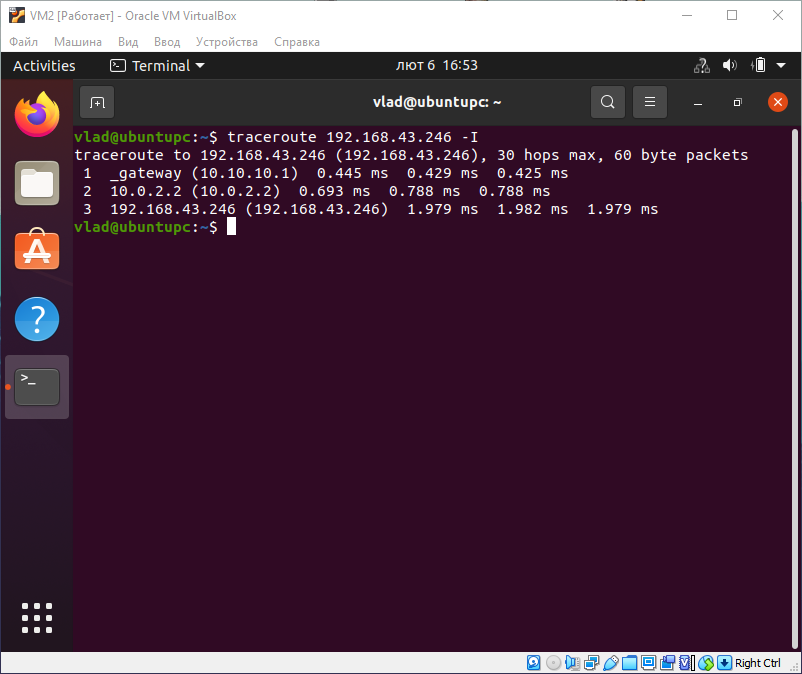

 5. Check access to the internet

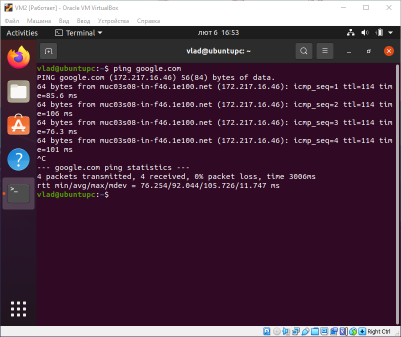

 6. Determine 8.8.8.8

 > 8.8.8.8 it is a google.dns

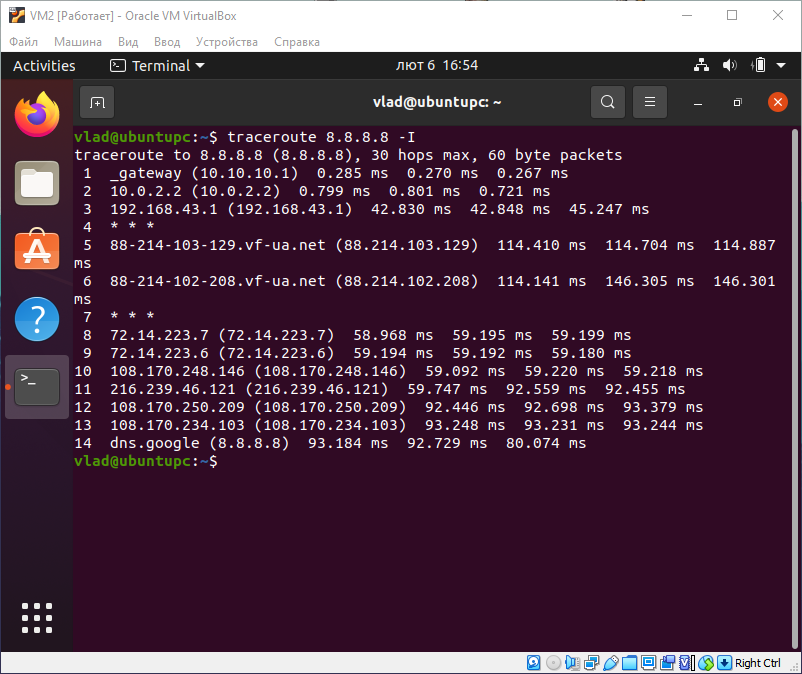

 7. Determine ip address epam.com

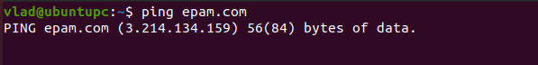

 8. Determine default host gaateway and route table

> Route table

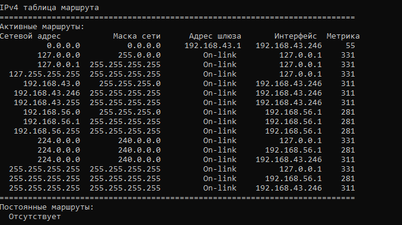

> Defatult gateway

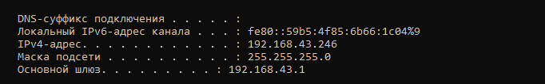

 9. Trace the route google.com

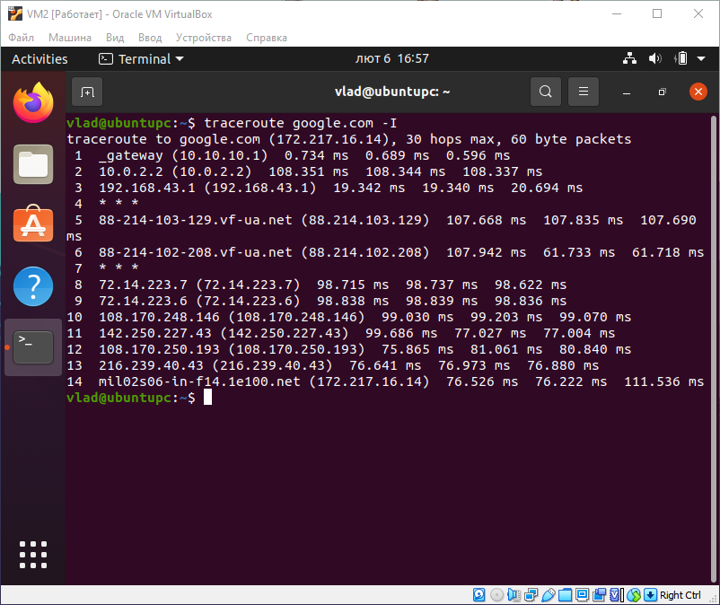