# Linux Administration with Bash
## Task 7.1
1. Network script

To see code follow this [link](https://github.com/vlddryga2233/DevOps_online_Kyiv_2020_Q42021Q1/blob/master/m7/task7.1/networkscan)

> Running script wothout any parameters
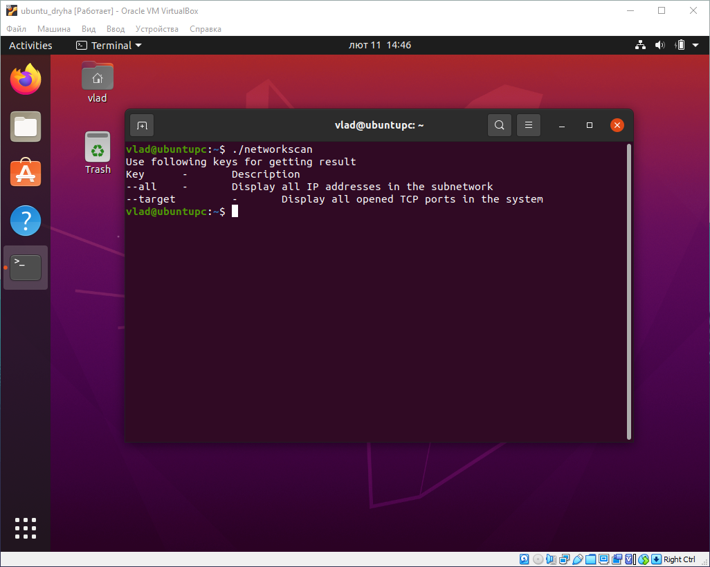

> Running script with --all key
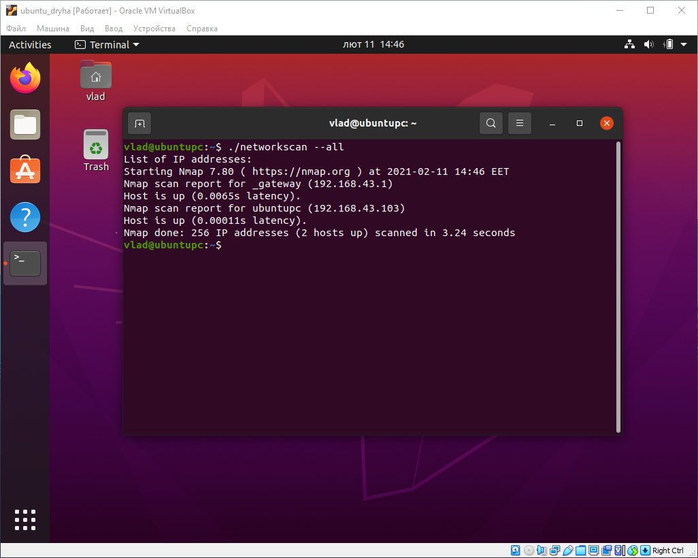

> Running script with --target key
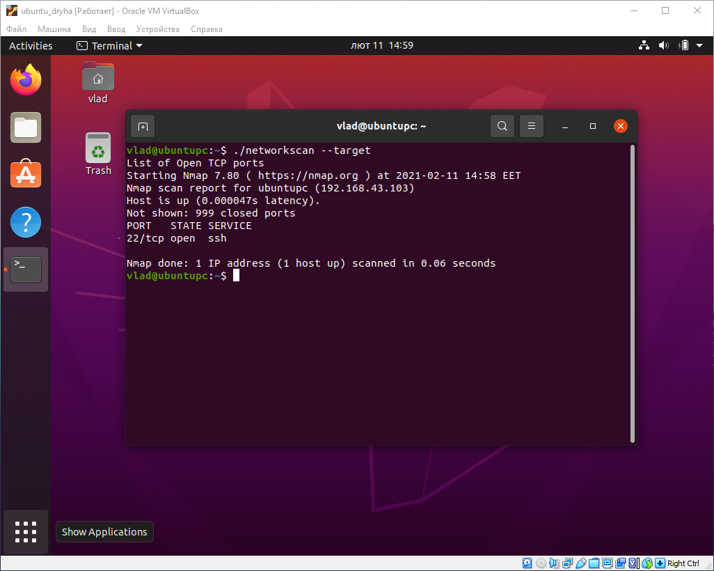

2. Reading apache_log.log

To see code follow this [link](https://github.com/vlddryga2233/DevOps_online_Kyiv_2020_Q42021Q1/blob/master/m7/task7.1/apache_log)

> The most requestable IP address

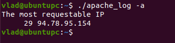

> The most requestable Page

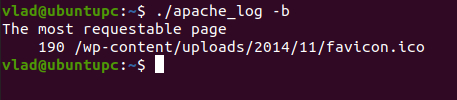

> Number of request from each IP
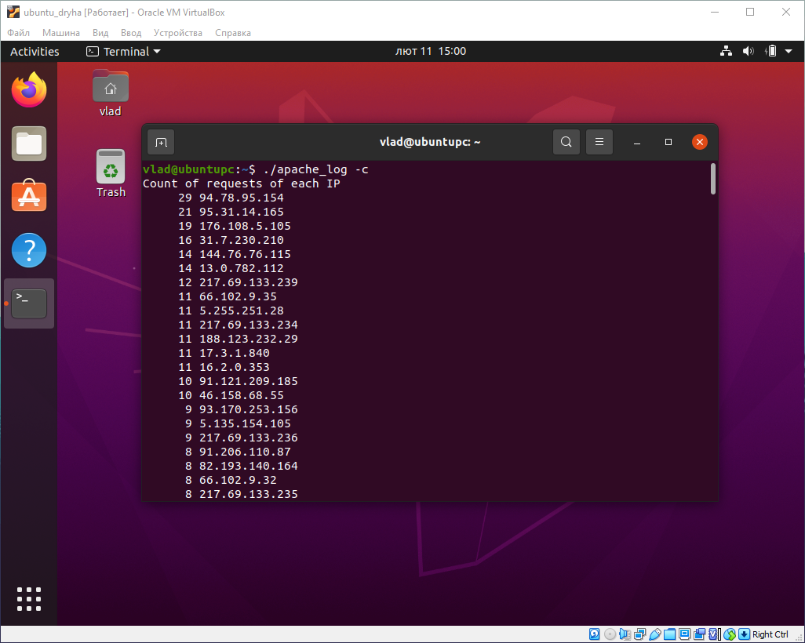

> Non-exist pages
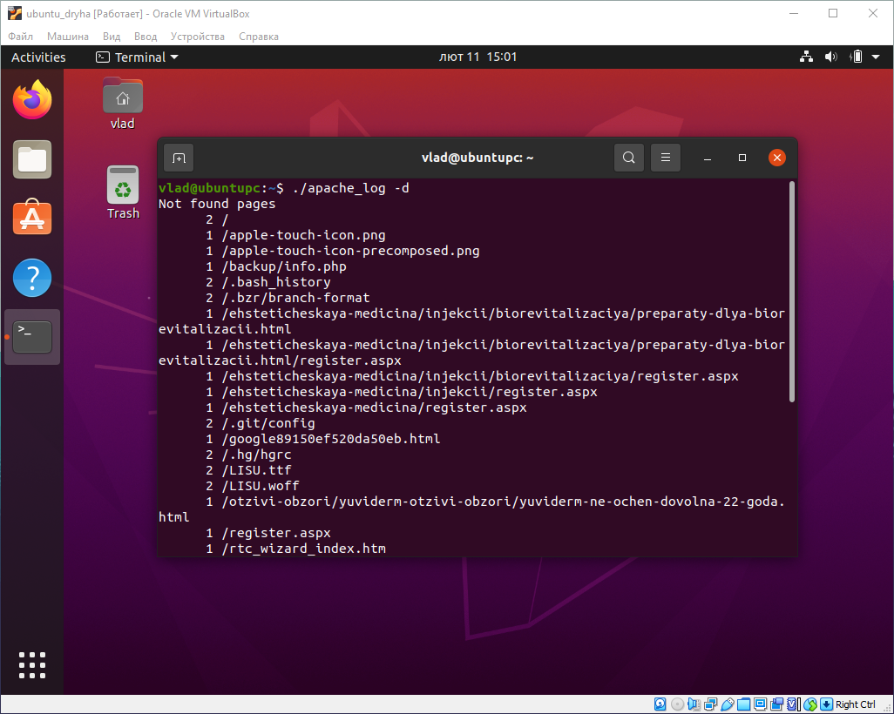

> The most requestable time
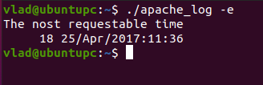

> Which bots are in the site
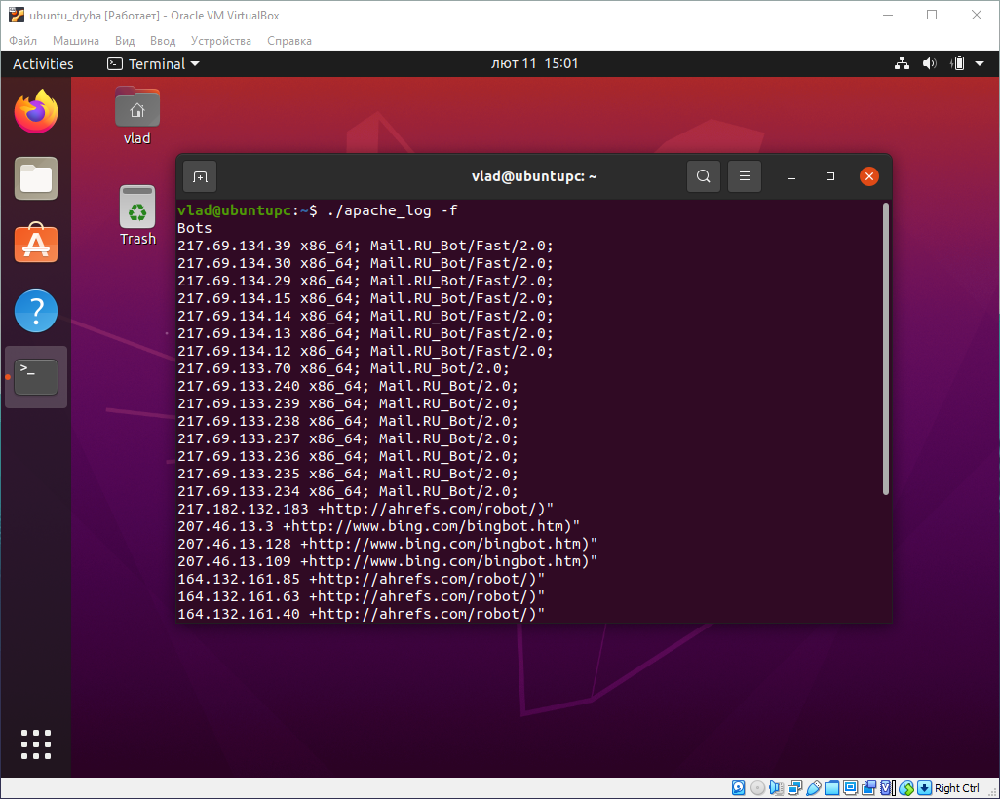

3. Backup script

To see code follow this [link](https://github.com/vlddryga2233/DevOps_online_Kyiv_2020_Q42021Q1/blob/master/m7/task7.1/backupscript)

> Create data
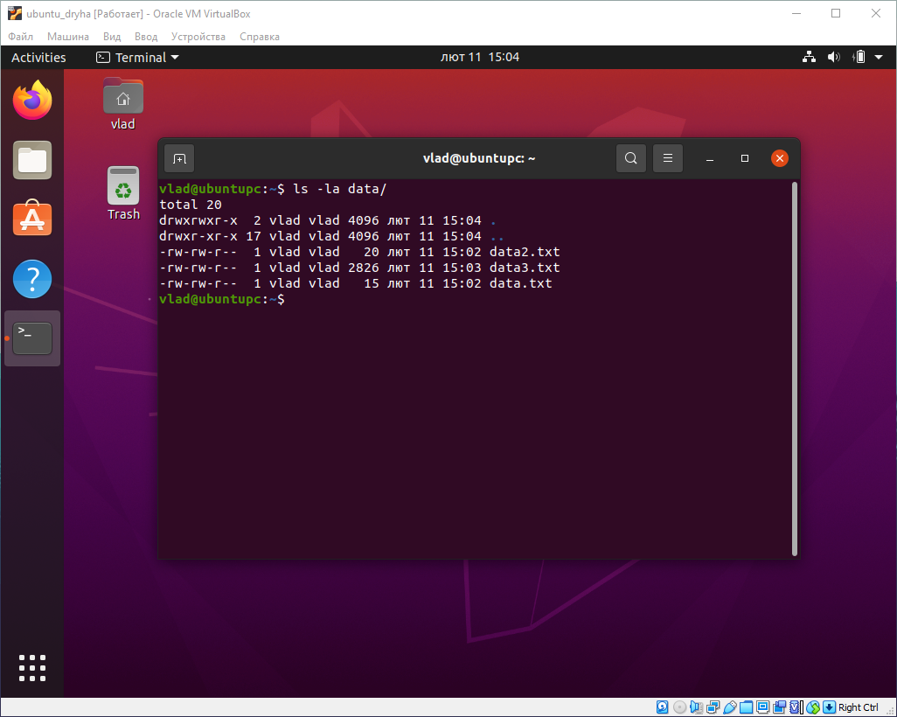

> Create backup
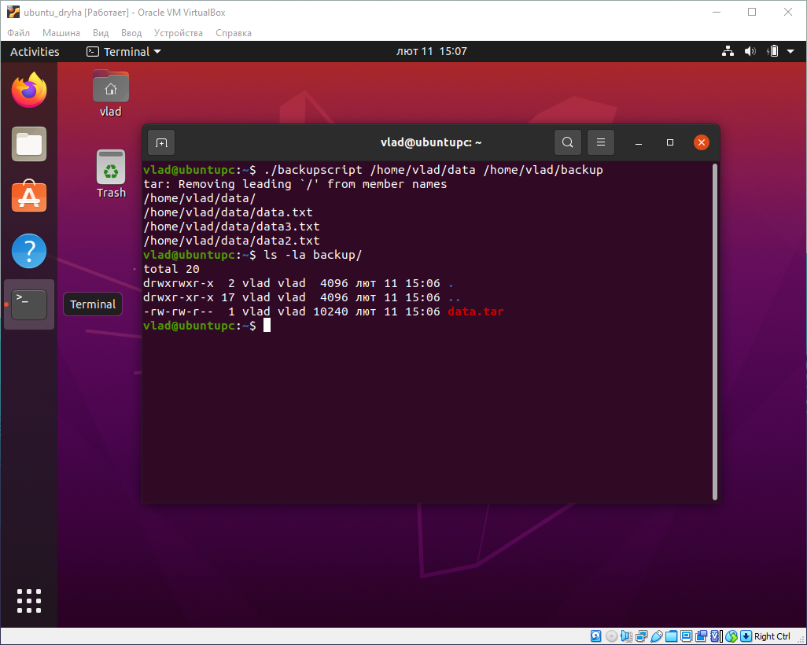

> Log note
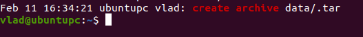

> crontab setting
