# Task 8.1
1. Create 2 instance in AWS


> First instance it is a Jenkins server

> Second instance it is a web server on wich will be our application

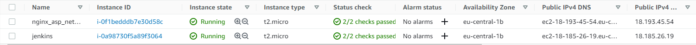

2. Install java on each instance 

```
sudo apt-get install openjdk-8-jdk
```

3. Install .net core and nginx server

```
wget https://packages.microsoft.com/config/ubuntu/20.04/packages-microsoft-prod.deb -O packages-microsoft-prod.deb
sudo dpkg -i packages-microsoft-prod.deb

sudo apt-get update; \
  sudo apt-get install -y apt-transport-https && \
  sudo apt-get update && \
  sudo apt-get install -y dotnet-sdk-5.0

  sudo apt-get update; \
  sudo apt-get install -y apt-transport-https && \
  sudo apt-get update && \
  sudo apt-get install -y aspnetcore-runtime-5.0

  sudo apt-get nginx
```

4. Configure webserver

> Setup nginx as reverse-proxy server 

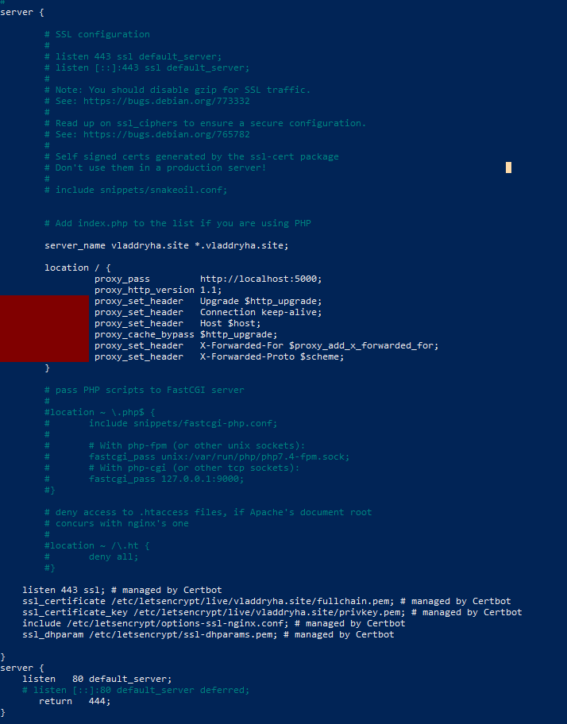

> Setup service that will be launch .net app

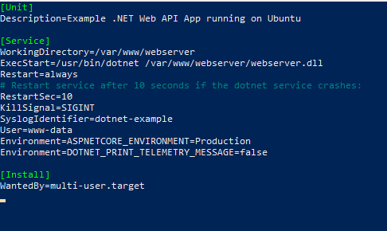

5. Create app in Visual Studio

> Create Asp .Net Core app based on MVC pattern

6. Push app on github

    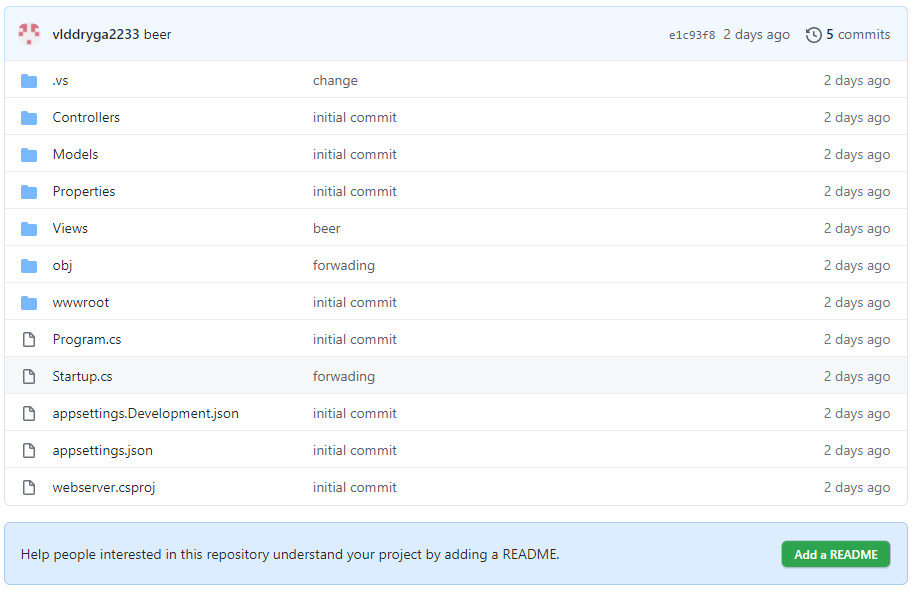

7. User Jenkins to build app on the webserver

> Create node and determine connection
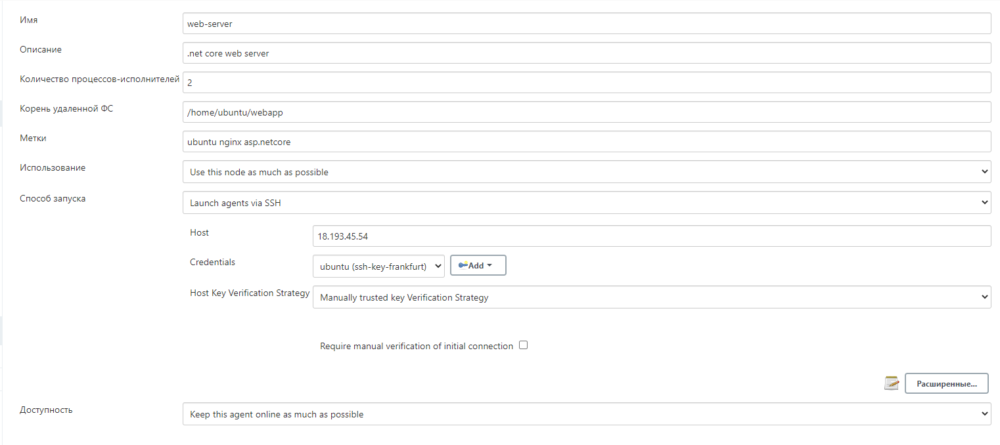

> Create job

> Connect to repos by jenkins
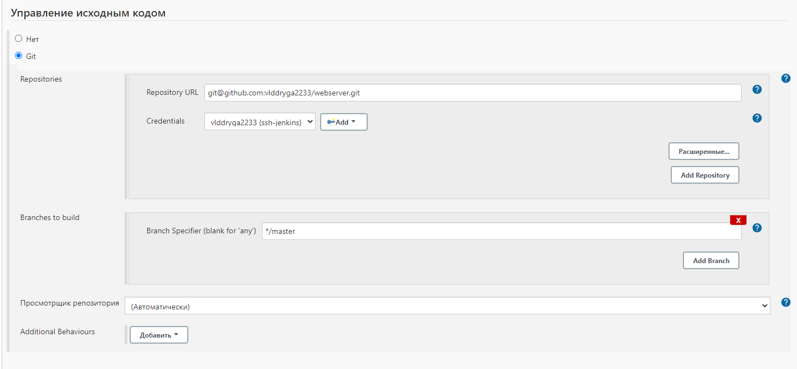

> Determine commands to build app on the server
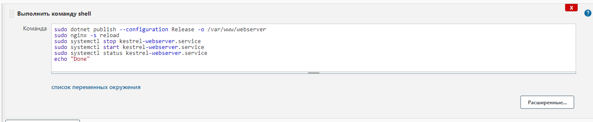


> Start job and get console output
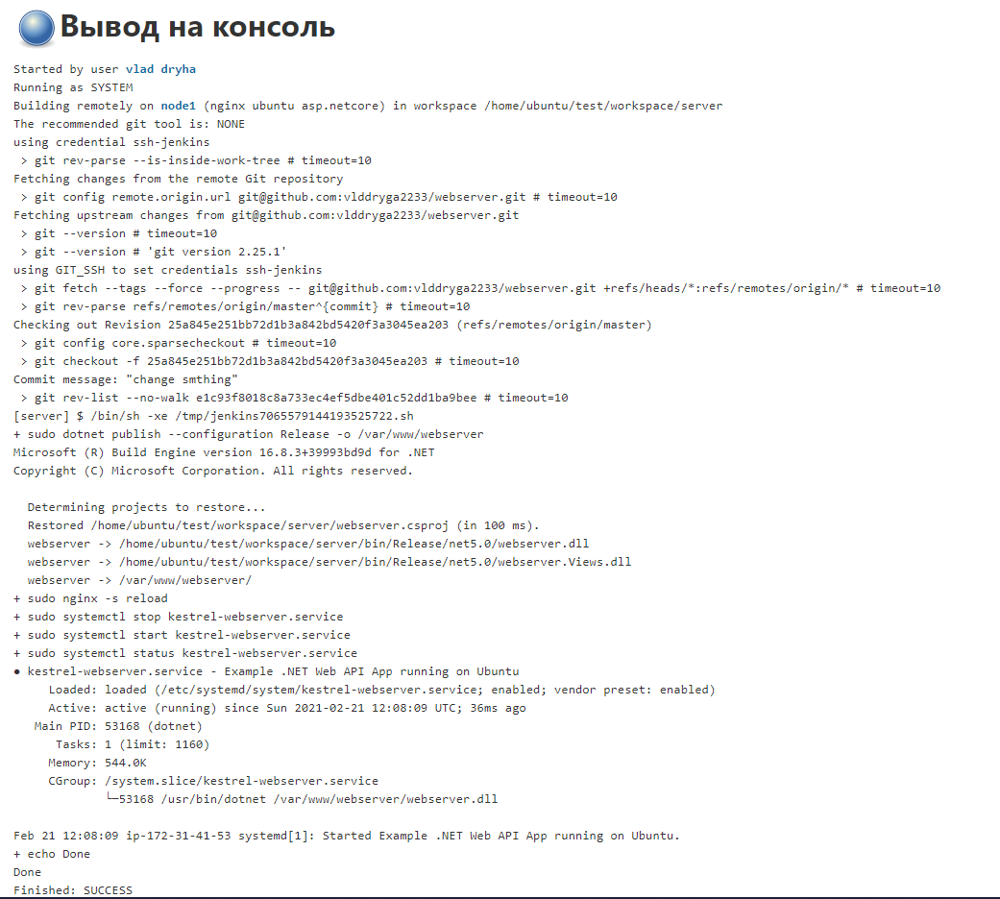

> Check changes on the server
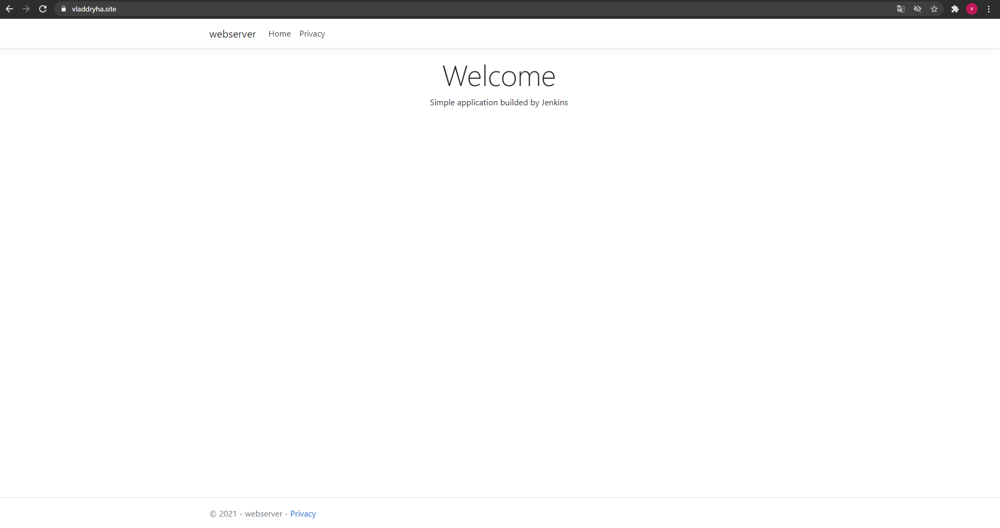

8. Change womething in the project


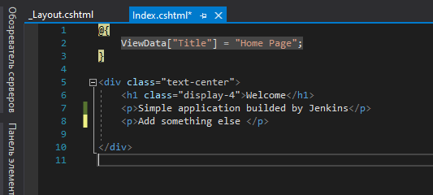


9. Start job to build new version


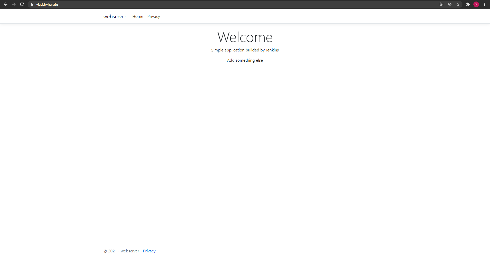
