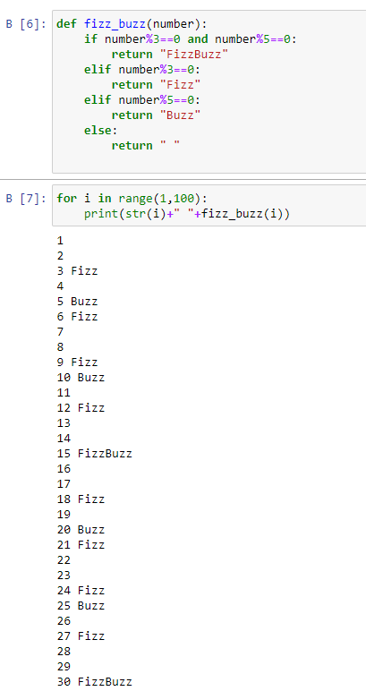
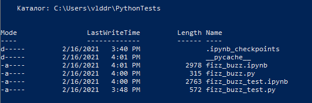
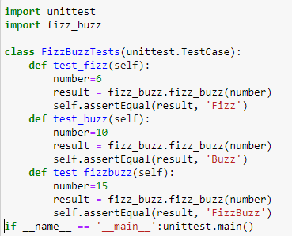
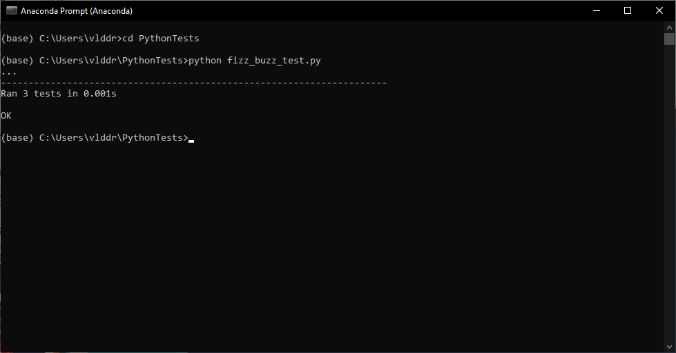
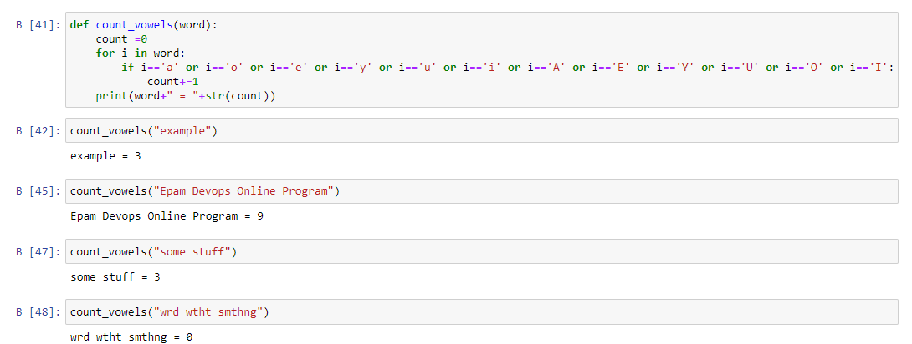

# Task 9.1
1. Create fizz_buzz function
    > Determine function and get output
    

    > Create folder and download files in .py resolution
    

    > Determine unit test
    

    > Run unit test and got a success result
    

2. Create count_vowels function

    > Determine function and get output
    